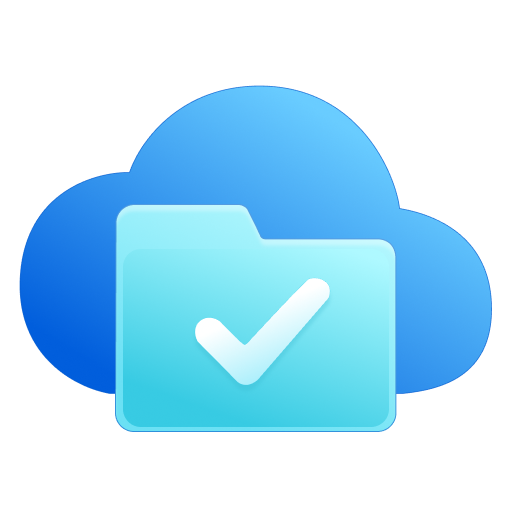

# edge-onedrive

> working in progress...

edge-onedrive is a lightweight OneDrive directory listing service.

- [ ] listing OneDrive files and folders.
- [ ] supporting upload files and folders.
- [ ] multiple Microsoft Graph national cloud deployments support.
- [ ] deploy on multiple platforms, including Cloudflare, Vercel, Node.JS, Bun and more.

## Microsoft Graph national cloud deployments

National cloud | Azure portal endpoint | Microsoft Entra ID endpoint
--- | --- | ---
Azure global service | https://portal.azure.com | https://login.microsoftonline.com
Azure US Government | https://portal.azure.us | https://login.microsoftonline.us
Azure China operated by 21Vianet | https://portal.azure.cn | https://login.chinacloudapi.cn

National Cloud |	Microsoft Graph	| Graph Explorer
--- | --- | ---
Microsoft Graph global service |	https://graph.microsoft.com	| https://developer.microsoft.com/graph/graph-explorer
Microsoft Graph for US Government L4 (GCC High) |	https://graph.microsoft.us	| Not supported.
Microsoft Graph for US Government L5 (DOD) |	https://dod-graph.microsoft.us	| Not supported.
Microsoft Graph China operated by 21Vianet |	https://microsoftgraph.chinacloudapi.cn	| Not supported.
